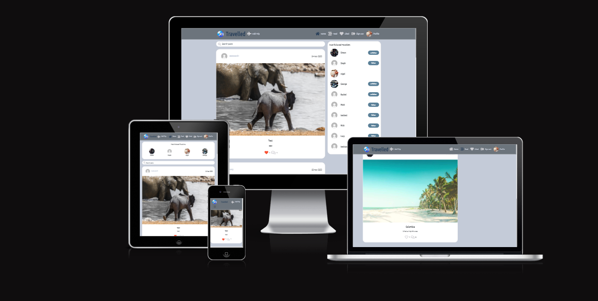

# Travelled (front end)

## Links

- Deployed API Heroku [link](https://travel-checker-api-nd.herokuapp.com/)
- Deployed Frontend Heroku [link](https://travelled.herokuapp.com/)
- API backend [repository](https://github.com/Niged01/travel-checker-api)
- [Development board]()
- [User Story board])



# Table Of Contents

1. [UX](#ux)
    1. [Site Purpose](#site-purpose)
    2. [Site Goal](#site-goal)
    3. [User Stories](#user-stories)
2. [Design](#design)
    1. [Colour Scheme](#colour-scheme)
    2. [Typography](#typography)
3. [Features](#features)
    1. [Navigation bar](#navigation-bar)
    2. [Home](#home)
    3. [Trips](#Trips)
    4. [For you page](#For-you-page)
    5. [Liked](#Liked)
    6. [Profile page](#profile-page)
    7. [Registration](#registration)
    8. [Not Found page](#not-found-page)
4. [Future features](#future-features)
5. [Testing](#testing)
6. [Bugs](#bugs)
    1. [Fixed](#fixed)
    2. [Unfixed](#unfixed)
7. [Technologies used](#technologies-used)
    1. [Languages](#languages)
    2. [Frameworks, libraries, and programmes](#frameworks-libraries-and-programmes)
8. [Project Setup](#project-setup)
9. [Components](#components)
10. [Deployment](#deployment)
    1. [First deployment](#first-deployment)
    2. [Final deployment](#final-deployment)
11. [Credits](#credits)
12. [Acknowledgements](#acknowledgements)

## UX
### Site Purpose
- Travelled is the app created to bring the travel community together, In the first stages of the site development uses will be able to add trips and follow their travel buddies. It is to share journeys and travelled stories amongst those who have the travel bug.

### Site Goal

- The goal is to become the one stop shop so to speak for all things travel. This will be implemented in stages as the site users build.

### User Stories
- I have put user stories as issues as part of agile development you can find the link [here]()

- I have also linked my user stories to a kanban board to make them easier to work on you can find the link [here]()

## Design


### Colour Scheme

- As a traveller myself the colour scheme I was immediately drawn to was one I have used previously a mixture of cool and warm blues grays whites which evokes a sense of calm and going somewhere when in the sky.


### Typography

- TBC


## Features
### Navigation bar
- There is a navigational bar down the side for larger screens, with different icons depending on wether you are logged in or not 

- Large screen logged out


- Large screen logged in


- The smaller screens have a burger icon which reveals the same navigational bar as larger screens, the heading is also a link back to the home page.


- There is an underline on the link that the user is on to show where they are on the site.

### Home
- The home page  has a search function at the top, it also has infinite scroll on the posts for ease of use.


- The home page has all the created  trip's by all users, logged in users can like other users trip's, users can comment on trip's. These show on the trip itself.


- comments can be edited and deleted via the dropdown menu


- There is a dropdown menu for owner users to edit or delete the trip, the edit button takes to a form to edit the trip which is prefilled


- Clicking on a trip from the home page takes you to the single trip which shows all comments underneath, the comments have an infinite scroll function for ease of use.

- Logged in users can create a new memo by clicking on the **Add trip** link in the navigational bar, this will take them to the create trip


### Trips

- Trips is where the user can create their trip post to send out into the community. 

### For you page - FYP
- The FYP feeds the user all the posts from the users they follow.


### Liked
- The liked page can be reached by the **Liked** link on the navigational bar and shows all the liked posts the user has liked. The page has an infinite scroll for ease of use.


### Profile page
- The profile page can be reached via the main navigational bar, or by clicking any user avatar, the user that owns the profile can edit their name, bio and profile picture, they can also change their username and password. the profile page shows that users achievement posts.


### Registration
- A user can Sign up to get full use of the site to be able to follow other users, like trips and post their own trips.
The Signup form once completed takes the user straight to the signin page which then redirects to the site.


### Not Found page
- If a user comes to a page that doesnt exist it will display a page saying its not found, the navigational bar is still present to take them wherever they want to go.


## Future features
- I would like to implement a groups create to the site, so that travel buddies can create trips together.
- I would like to implement the skyscanner api intergration so that users can search flights directly from the site.
- I would like to implement the ability to tag and share trips amongst the users travel buddies.
- I would like to implement instant msging amongst the users signed in. 
- On trip posts I would like to implement user ability to create whole abulm of trip with mutliple images.

## Testing
- The testing for the front end part of the project can be found [here](./TESTING.md)
- The testing for the backend part of the project can be found [here](https://github.com/Niged01/travel-checker-api/blob/main/TESTING.md)

## Bugs
### Fixed

- Defult profile image not rendering, The code was correct checked with a tutor. The cloudinary URL was where the problem lay. That has now been sorted. 

- When click follow goes to a blank screen same for unfollow. Bug fixed by asking if each array existet in profilecontextdata.js in the popular profiles follow and unfollow function

- Bug Add Trip wont post when I click create: This was because image was to large for site a simple fix changed image not a bug but code working as expected.

- Bug When clicking on post popular profiles was not rendering it was just the place holder text. Perfomed a traceback and found PostPage.js I had left the placeholer there and not imported popularProfiles. I imported and repalce the place holder witht the rendering code and now it is working as expected.

- Bug On profile page the numbers of posts followers and following are not adding up.

### Unfixed
- none known

## Technologies used
### Languages

- HTML
- CSS
- Javascript
- Python
- SQL - postgres
### Frameworks, libraries, and programmes

- Balsamiq
    - For the wireframes
- Git
    - For version control, committing and pushing to Github
- Github
    - For storing the repository, files and images pushed from Gitpod
- Gitpod
    - IDE used to code project
- Heroku
    - used to deploy the application
- Django
    - used to build the backend database, that serves as an API for the front end part of the  project
- ReactJS
    - To build components that collectively form the front end of the application.
- React-Bootstrap
    - The styling side of the front end application used as it was introduced during the walkthrough project.
- icolorpalette
    - used for the colour pallete
- Google fonts
    - used for selecting fonts for project.
- Amiresponsive
    - used for testing responsiveness and providing screenshots in different sizes.


## Project Setup

1. Create a new repository in **Github** and use the 'gitpod' button at the top to create workspace
2. Create the React app by running the terminal command:
```
npx create-react-app . --template git+https://github.com/Code-Institute-Org/cra-template-moments.git --use-npm
```
- enter y to confirm

3. Check the app is working by using terminal command:
```
npm start
```
4. the browser should be showing you the React logo
5. In **App.js** remove the logo import, remove the custom React header element, and replace with a 'H1' element containing a line of text such as 'hello world'.
6. Check this 'H1' is being shown in your browser preview.
7. Do a terminal command to add, commit and push the code to Github


## Components

- Several components were setup throughout the project and was reused throughout.
1. MoreDropdown.js
    - added a dropdown menu for memo's, achievements, todo and profile, to allow users to edit and delete their own content.
2. AxiosDefault.js
    - helped with communication with the backend API
3. Asset.js
    - was used for the loading spinner throughout the site.
4. Avatar.js
    - used for the users avatar throughout the site.
5. CurrentUserContext.js
    - confirm users logged-in status to determine what functionality is available to that user.
6. ProfileDataContext.js
    - used for watching and unwatching users
7. useRedirect.js
    - redirects a user to another page if not authorised to access the page they are trying to access.
8. utils.js
    - supplies functionality to all of the components that utilise the Infinite Scroll.

## Deployment
### First deployment

1. In **Heroku** create a new app, give it a name and choose location.

2. In the **deploy** tab, go to 'deployment method', choose 'Github'

3. Search for the repository in Github that you want to connect and click on the connect button

4. In the 'manual deploy' section click on 'deploy branch'

5. The build log will run, when complete you will see a message saying 'build succeeded'

6. An 'Open App' button will appear, click this to take you to your deployed app.

7. You can enable automatic deploys in the 'deployment section' so each time you push your code to 'Github' your deployed app will be updated.

### Final deployment

1. Ensure all finalised code is committed and pushed to Github

2. Log into Heroku in the dashboard for your front end React project select **Deploy** from the top bar

3. Select **Deploy branch** and wait for build to complete

4. If successfully built you will see a message *deployed to heroku* click the **open app** button.

5. Test your deployed version matches development version.

## Credits
- The code institute walk through *moments* project I used as my jumping off point for the project.

- https://unsplash.com For images use through out the project. 

- https://www.flaticon.com/free-icons For the icons

- https://icons8.com/icons/set/search For the search icon with the world in it.

- icolorpalette image used for the colour pallete

## Acknowledgements

- Code institute for the learning material and support.
- Tutor support for having tooling up my knowledge big shout out to them all.
- All of the slack community for the assistance to be patient with me.
- My class mates who have always been there in the trenches together.
