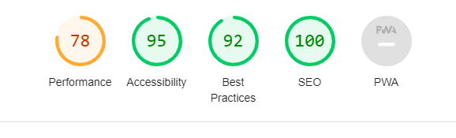
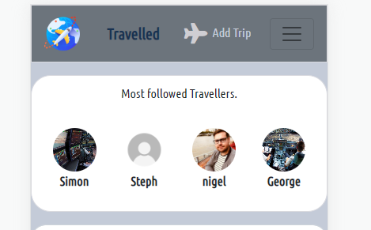
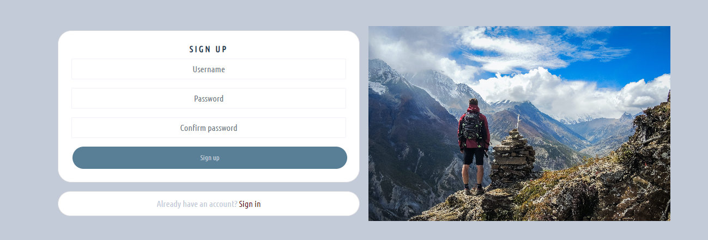
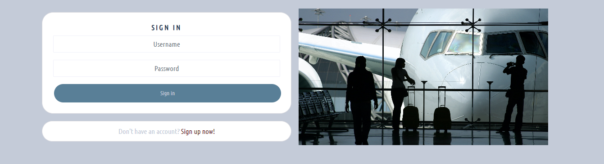
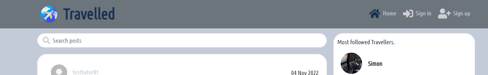
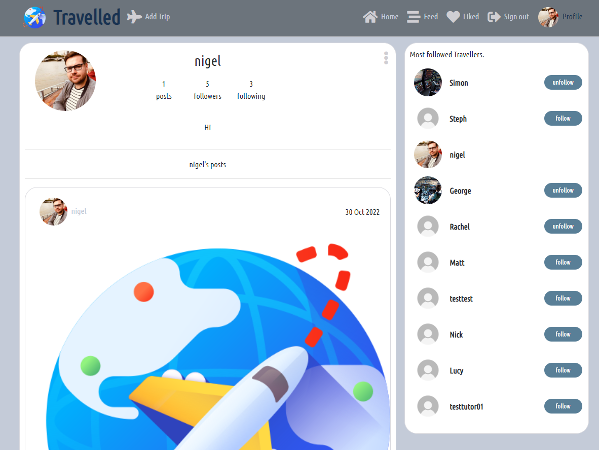
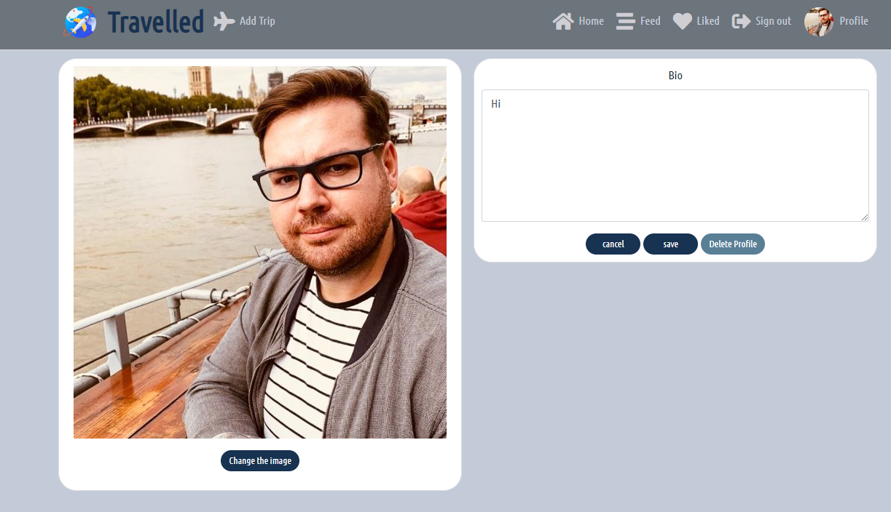
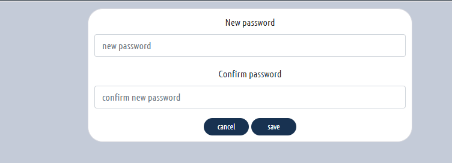
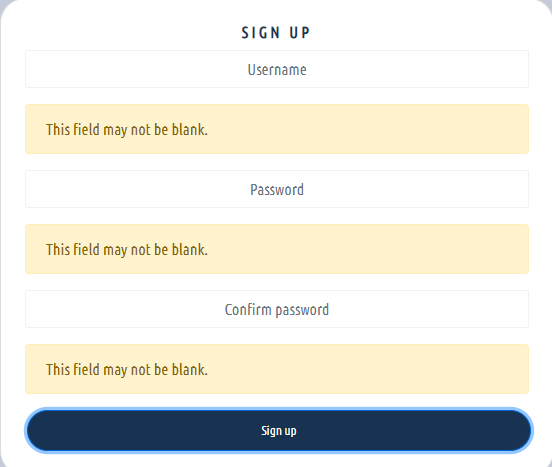

# Testing For Frontend React Travelled

back to the [README.md](README.md)

## Contents
1. [Manual](#manual)
2. [Validation](#validation)
3. [Lighthouse](#lighthouse)
4. [User Stories](#user-stories)
    1. [Navigation and authentication](#navigation-and-authentication)
    2. [Trip page](#trip-page)
    3. [Comments](#comments)
    4. [Liking](#liking)
    5. [Profiles](#profiles)
    6. [User experience](#user-experience)

### Manual

- Manual testing were carried out for the URL paths, search functionality and **CRUD** functionality, all were made into tables and checked off.

### URL Path tests

### Search testing
- The same table was used for development and deployment everything working as expected.

### CRUD Testing
- Table was made to check a user could **C**reate, **R**ead, **U**pdate, or **D**elete items.
- The table for deployed was testing in the back link to the front end [here](https://github.com/Niged01/travel-checker-api/blob/main/TESTING.md)
- I used a key in the table 
    - LI meaning the user was logged in, and so could Create, and read.
    - LO meaning the user was not logged in and so could only read.
    - LI/O meaning the user was logged in **and** the owner so had full CRUD functionality.

The same table was used for checks in deployed application all checks working.
### Validation

- The pep8 site is currently unavailable, we were advised to install pycodestyle in the terminal, the terminal bar then shows any problems in the workspace, no problems were found in the files.

### Lighthouse

- Lighthouse scores, There are advisements to reduce Javascript code or unused code I have noted this for further updates later.

### User Stories
#### Navigation and authentication

- As a User I can access a navigation menu so that I can easily get between pages
    - A navigation menu for small and larger screens were added.
    - Smaller screens

    - larger screens

- As a user I can navigate through pages quickly so that I can view content without having to refresh the page
    - The navigational bar is visible on small screens via the burger menu, and at the side on larger screens, infinite scroll has been put on pages for posts and comments so the user doesn't have to refresh the page.

- As a user I can register for an account so that I can access all content
    - A signup form is available to users to register for the full functionality of the site.

- As a user I can log in to the site so that I can access all content for a logged in user

    - A login form is required to access full functionality

- As a user I can see if I am logged in or logged out so that I can log in or out as needed
    - As a logged in user the profile picture shows on the side navigation bar. A logged in user can access the create functions on the side navigation bar unlike a logged out user.

- As a user I can maintain my logged in status until I choose to log out so that my user experience is not compromised
    - Refresh tokens have been set within the site so a user can remain logged in.

- As a logged out user I can see sign in or register options so that I can sign in or register
    - These options are on the logged out user navbar

- As a user I can view other users avatars so that I can easily identify users of the site
    - The profiles are displayed on the right of the site with their avatar pictures once they have added them to their profiles. They are also on each post which links to that users profile page

#### Trip page

#### Comments

#### Liking

#### Profiles

- As a user I can create my own profile so that others can see information about me
- As a user I can update my profile so that the information about me is up to date
    - A profile is created with a username when registering, a user can update their information via the dropdown menu to edit their profile.

- As a user I can view the profile pages of users so that I can get to know more information about them
    - by clicking on an avatar in the profiles column or on a post it will take the user to the specific users profile page.

- As a user I can update my username and password so that I can keep my profile secure
    - A dropdown menu is available to owner users to update their username and password

#### User experience

- As a user I can keep scrolling through posts that are loaded automatically so that I don't have to click next page to see other posts
    - There is an infinite scroll on all pages and on the comments section too, so a user doesnt need to click any buttons to see everything.
- As a user I can easily use the site so that I want to keep returning
    - The site has a simple design without content that isnt necessary to make it easier on the eye, with minimal glaring colours, the forms have validation on them so a user knows if there is something wrong. There is also an icon highlight on the navigational menu so the user knows which page they are on.

back to the [README.md](README.md)
